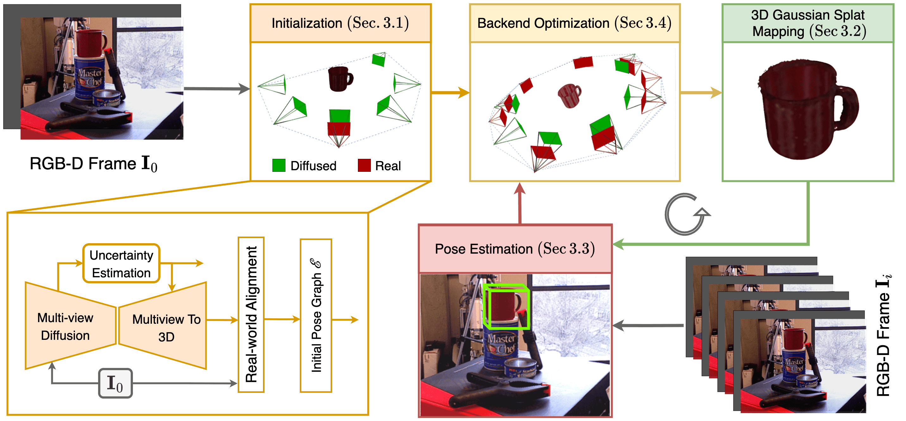

# UnPose: Uncertainty-Guided Diffusion Priors for Zero-Shot Pose Estimation

[Zhaodong Jiang](https://scholar.google.ca/citations?user=ISNrsywAAAAJ&hl=en&oi=sra)$^{1,2}$, [Ashish Sinha](https://sinashish.github.io)$^{1}$,  [Tongtong Cao](https://scholar.google.com/citations?user=SkzzXSYAAAAJ&hl=en)$^{1}$, [Yuan Ren](https://scholar.google.com/citations?user=P4Rp5uAAAAAJ&hl=en)$^{1}$, [Bingbing Liu](https://scholar.google.ca/citations?user=-rCulKwAAAAJ&hl=en)$^{1}$, [Binbin Xu](https://binbin-xu.github.io/)$^{1}$

$^{1}$ Huawei Noah's Ark Lab, Toronto  $^{2}$ University of Toronto, Canada


This repository contains the code and video demos for our project website [UnPose](https://frankzhaodong.github.io/UnPose/) accepted to [CORL 2025](https://www.corl.org/).




> TL;Dr: A zero-shot, model-free 6D pose estimation and reconstruction framework that incrementally refines a 3D Gaussian Splatting model using diffusion priors and uncertainty-guided fusion from RGB-D inputs.

## Core Idea

Estimate epistemic uncertainty from a pretrained 2D-to-3D diffusion model to continually refine a 3DGS-represented object for 6DOF pose estimation in a factor-graph optimzation framework.


<!-- **NOTE:** We might release the code in the future once it has obtained legal approval. -->

## BibTex

If you use this work in your research, please cite our paper:

```bibtex
@inproceedings{jiang2025unpose,
  title={UnPose: Uncertainty-Guided Diffusion Priors for Zero-Shot Pose Estimation},
  author={Jiang, Zhaodong and Sinha, Ashish and Cao, Tongtong and Ren, Yuan and Liu, Bingbing and Xu, Binbin},
  booktitle={Conference on Robot Learning (CoRL)},
  year={2025}
}
```

## Acknowledgments
Parts of this project page were adopted from the [Nerfies](https://nerfies.github.io/) page.

## Website License
<a rel="license" href="http://creativecommons.org/licenses/by-sa/4.0/"></a><br />This work is licensed under a <a rel="license" href="http://creativecommons.org/licenses/by-sa/4.0/">Creative Commons Attribution-ShareAlike 4.0 International License</a>.
